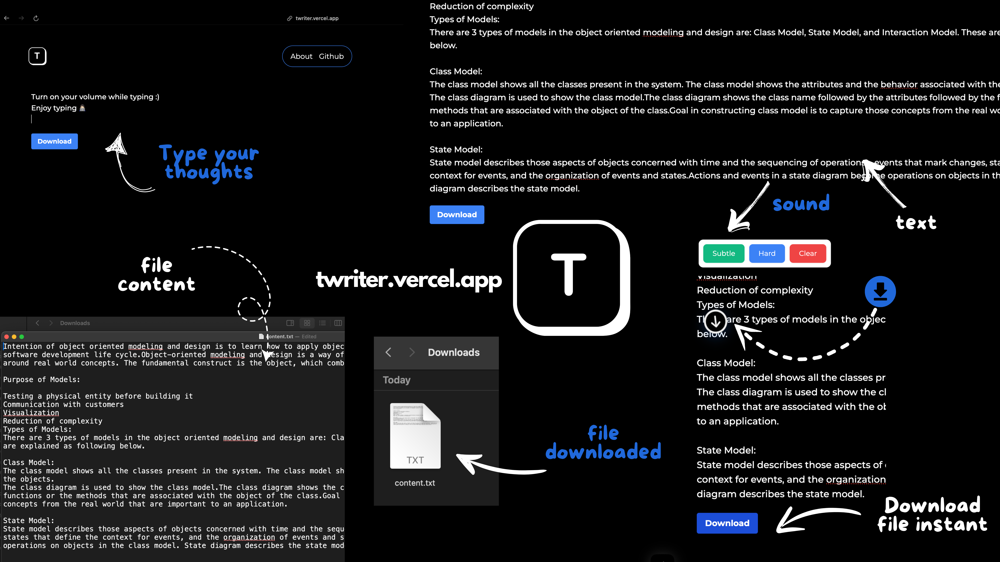

# T-Writer

  

## Live Demo
- [twriter.ninadvyas.tech](https://twriter.ninadvyas.tech) / [twriter.vercel.app](https://twriter.vercel.app)

## Overview

T-Writer seeks to recreate the feel of typing on a classic typewriter using modern digital interfaces. It combines the sound of traditional typewriters with the convenience of digital platforms.

## Features

- **Responsive Design**: Works seamlessly across desktops, tablets, and mobile devices.
- **Sound Effects**: It includes sound effects to enhance the user experience.

## Getting Started

To get started with T-Writer, follow these steps:

1. Clone the repository: `git clone https://github.com/ninadvyas/T-Writter.git`
2. Navigate to the project directory: `cd t-writer`
3. Install dependencies: `npm install`
4. Run the application: `npm start`
5. Open the application in a web browser: `http://localhost:3000`

## License

This project is licensed under the MIT License - see the [LICENSE](LICENSE) file for details.

